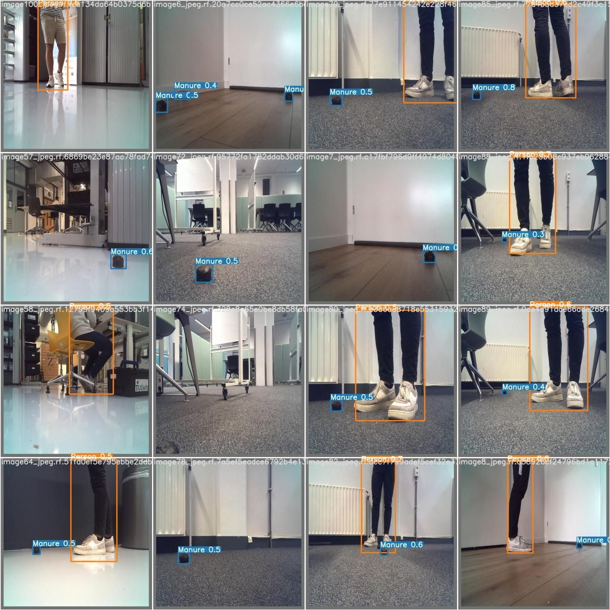
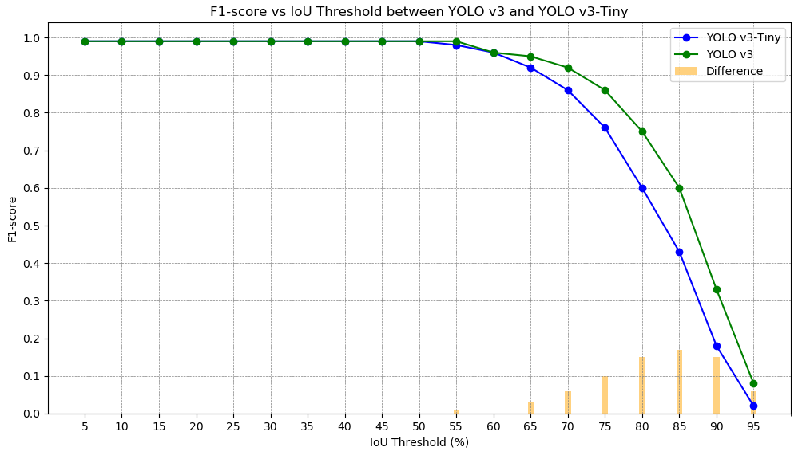

# Real-Time Object Detection and Avoidance in Robotics: Comparing Tiny-YOLOv3 and YOLOv3

Authors: Guillem Ribes Espurz (5229154), Ricardo Ramautar (6109217)

## Table of Contents
- [Abstract](#abstract)
- [Introduction](#introduction)
- [Motivation](#motivation)
  - [Training](#training)
  - [Robot Implementation](#robot-implementation)
- [Results](#results)
- [Discussion and Limitations](#discussion-and-limitations)
  - [Discussion](#discussion)
  - [Limitations](#limitations)
- [References](#references)
    
## Abstract

## Introduction

## Motivation 
In numerous applications, robots must operate in unregulated and dynamic environments filled with moving obstacles. To navigate in these challenging environments, robots require obstacle avoidance systems to ensure they do not collide. For instance, self-driving vehicles need to account for other vehicles, pedestrians, and cyclists, whose actions can be unpredictable. Consequently, the obstacle avoidance systems in these self-driving vehicles must be able to account for sudden, sporatic behavior. 

Nowadays, in robotics in order to perform obstacle avoidance other sensors such as LiDAR or ultrasound are being used instead of cameras. This introduces an issue of not knowing what obstacle you are avoiding (no classification performed). In some cases you don’t want to avoid all obstacles, if for example it’s a cleaning robot you don’t want it to avoid litter you instead want it to pick it up. However, if the robot can not differentiate between litter or an actual obstacle then it doesn’t perform accordingly. Which is why cameras should be introduced for obstacle classification in order to perform obstacle avoidance. Nonetheless, the use of cameras introduces larger models to perform obstacle avoidance, which in turn require expensive GPUs. However, not all robots are equipped with such GPUs due to their cost and space constraints. A more efficient solution is to develop smaller, more efficient models that demand minimal computational power. This would enable real-time obstacle detection on any robot, regardless of its hardware.

## Implementation 

### Dataset
A new dataset containing images of manure and people was created to train the models on. However, note that for praciticality, the manure was 3D printed. All the images in the dataset were made using the camera in the robot, such that the images are representative to what the robot can expect. Additionally, images were taken in various different environments with different surfaces and different lighting conditions to make the models robust to changes in environment. 

Approximately 600 images were taken. However, to increase the size of the dataset, these images were augmented by increasing and decreasing the brightness by 30%. In total, the complete dataset constituted 1783 images. 80% Of these images were randomly assigned to the training set, whereas the other 20% was assigned to the test set. 

### Training 
Both YOLO v3 and YOLO v3-Tiny were trained on the training set over 10.000 batches with a batch size of 64 images.

### Robot Implementation 
After obtaining the weights in the correct format (.weights) for the YOLO v3 models, the next step was to implement them on the robot. Initially, the darknetROS repository was utilized, as it supports the integration of YOLO v3 models with ROS and requires only the implementation of the correct weights. By running YOLO v3-Tiny directly on the robot via darknetROS, we achieved an average frame rate of merely 0.2 FPS.

<!-- For reference, the model was first tested on a laptop to evaluate its performance. As shown in the figure below, the model consistently detected manure and people correctly. However, the frame rate achieved on the laptop was approximately 1.5 fps, resulting in noticeable lag during visualization. This low frame rate was the result of the lag in images being sent from the robot to the laptop.

To address this issue, the model was then run directly on the robot. Unfortunately, this led to a significant drop in performance, with the frame rate plummeting to 0.2 fps, which was far from acceptable. -->

To improve performance, the darknet configuration was converted to ncnn, a high-performance neural network inference framework optimized for mobile platforms. By taking better advantage of the robot's hardware, a much greater frame rate could be achieved. When running YOLO v3 on the robot using ncnn, an average frame rate of 3.92 FPS was achieved with a standard deviation of 0.47 FPS.

<strong>Add a table of the fps of YOLOv3 and tiny-YOLOv3</strong>

## Results
The accuracy of the trained models was tested on the test set, which was done on a laptop. [Figure 1](#F1Score) shows the F1 score of both YOLO v3 (green) and YOLO v3-Tiny (blue) for a range of IoU thresholds.  Additionally, the orange bars shows the difference between the two models. As can be seen from the graph, up until an IoU threshold of 50%, both models perform very well with an F1 score of approximately 0.99. This shows that both models are very effective in detecting the objects in question. However, from an IoU threshold of 50% onwards, the F1 scores of both models drop considerably. From this can be concluded that although effective in detecting objects, neither model is very accurate in setting the bounding boxes. However, the graph also shows that YOLO v3 results in a noticeably higher F1 score for greater IoU scores compared to YOLO v3-Tiny, as also indicated by the orange bars. This demonstrates that YOLO v3 more accurately places the bounding boxes than YOLO v3-Tiny. Hence, although both models classify the images equally well, YOLO v3 sets the bounding boxes more precisely.

<!-- **Overall Performance Metrics of YOLO v3-Tiny** -->
<!-- | IoU Threshold | Precision | Recall | F1-score | TP  | FP  | FN  | Average mAP (%) |
|---------------|-----------|--------|----------|-----|-----|-----|-----------------|
| 5%            | 0.99      | 0.99   | 0.99     | 715 | 8   | 10  | 99.53           |
| 10%           | 0.99      | 0.99   | 0.99     | 715 | 8   | 10  | 99.53           |
| 15%           | 0.99      | 0.99   | 0.99     | 715 | 8   | 10  | 99.53           |
| 20%           | 0.99      | 0.99   | 0.99     | 715 | 8   | 10  | 99.53           |
| 25%           | 0.99      | 0.99   | 0.99     | 715 | 8   | 10  | 99.53           |
| 30%           | 0.99      | 0.99   | 0.99     | 715 | 8   | 10  | 99.53           |
| 35%           | 0.99      | 0.98   | 0.99     | 714 | 9   | 11  | 99.45           |
| 40%           | 0.99      | 0.98   | 0.99     | 714 | 9   | 11  | 99.43           |
| 45%           | 0.99      | 0.99   | 0.99     | 715 | 8   | 10  | 99.31           |
| 50%           | 0.99      | 0.98   | 0.99     | 714 | 9   | 11  | 99.23           |
| 55%           | 0.98      | 0.98   | 0.98     | 709 | 14  | 16  | 98.40           |
| 60%           | 0.96      | 0.96   | 0.96     | 696 | 27  | 29  | 96.85           |
| 65%           | 0.92      | 0.92   | 0.92     | 665 | 58  | 60  | 91.65           |
| 70%           | 0.86      | 0.86   | 0.86     | 625 | 98  | 100 | 85.38           |
| 75%           | 0.76      | 0.76   | 0.76     | 553 | 170 | 172 | 71.32           |
| 80%           | 0.60      | 0.60   | 0.60     | 434 | 289 | 291 | 47.13           |
| 85%           | 0.43      | 0.43   | 0.43     | 310 | 413 | 415 | 24.18           |
| 90%           | 0.18      | 0.18   | 0.18     | 127 | 596 | 598 | 5.07            |
| 95%           | 0.02      | 0.02   | 0.02     | 15  | 708 | 710 | 0.17            | -->

### Overall Performance Metrics
<table>
<tr>
<td style="padding-right: 100px;">

**YOLO v3-Tiny**
| IoU Threshold | Precision | Recall | F1-score |
|---------------|-----------|--------|----------|
| 5%            | 0.99      | 0.99   | 0.99     |
| 10%           | 0.99      | 0.99   | 0.99     |
| 15%           | 0.99      | 0.99   | 0.99     |
| 20%           | 0.99      | 0.99   | 0.99     |
| 25%           | 0.99      | 0.99   | 0.99     |
| 30%           | 0.99      | 0.99   | 0.99     |
| 35%           | 0.99      | 0.98   | 0.99     |
| 40%           | 0.99      | 0.98   | 0.99     |
| 45%           | 0.99      | 0.99   | 0.99     |
| 50%           | 0.99      | 0.98   | 0.99     |
| 55%           | 0.98      | 0.98   | 0.98     |
| 60%           | 0.96      | 0.96   | 0.96     |
| 65%           | 0.92      | 0.92   | 0.92     |
| 70%           | 0.86      | 0.86   | 0.86     |
| 75%           | 0.76      | 0.76   | 0.76     |
| 80%           | 0.60      | 0.60   | 0.60     |
| 85%           | 0.43      | 0.43   | 0.43     |
| 90%           | 0.18      | 0.18   | 0.18     |
| 95%           | 0.02      | 0.02   | 0.02     |

<td>

**YOLO v3**
| IoU Threshold | Precision | Recall | F1-score |
|---------------|-----------|--------|----------|
| 5%            | 1.00      | 0.99   | 0.99     |
| 10%           | 1.00      | 0.99   | 0.99     |
| 15%           | 1.00      | 0.99   | 0.99     |
| 20%           | 1.00      | 0.99   | 0.99     |
| 25%           | 1.00      | 0.99   | 0.99     |
| 30%           | 1.00      | 0.99   | 0.99     |
| 35%           | 1.00      | 0.99   | 0.99     |
| 40%           | 1.00      | 0.99   | 0.99     |
| 45%           | 1.00      | 0.99   | 0.99     |
| 50%           | 1.00      | 0.99   | 0.99     |
| 55%           | 0.99      | 0.99   | 0.99     |
| 60%           | 0.96      | 0.96   | 0.96     |
| 65%           | 0.95      | 0.94   | 0.95     |
| 70%           | 0.92      | 0.91   | 0.92     |
| 75%           | 0.86      | 0.86   | 0.86     |
| 80%           | 0.75      | 0.75   | 0.75     |
| 85%           | 0.60      | 0.60   | 0.60     |
| 90%           | 0.33      | 0.33   | 0.33     |
| 95%           | 0.08      | 0.08   | 0.08     |

</td>
</tr>
</table>

<!-- **Class-wise Average Precision of YOLO v3-Tiny**
| IoU Threshold | Manure (%) | Person (%) |
|---------------|------------|------------|
| 5%            | 99.86      | 99.20      |
| 10%           | 99.86      | 99.20      |
| 15%           | 99.86      | 99.20      |
| 20%           | 99.86      | 99.20      |
| 25%           | 99.86      | 99.20      |
| 30%           | 99.86      | 99.20      |
| 35%           | 99.70      | 99.20      |
| 40%           | 99.70      | 99.16      |
| 45%           | 99.70      | 98.93      |
| 50%           | 99.53      | 98.93      |
| 55%           | 98.71      | 98.08      |
| 60%           | 95.62      | 98.08      |
| 65%           | 88.62      | 94.68      |
| 70%           | 80.79      | 89.97      |
| 75%           | 68.60      | 74.03      |
| 80%           | 50.39      | 43.88      |
| 85%           | 33.62      | 14.74      |
| 90%           | 9.09       | 1.06       |
| 95%           | 0.35       | 0.00       |

**Class-wise Average Precision of YOLO v3**
| IoU Threshold | Manure (%) | Person (%) |
|---------------|------------|------------|
| 5%            | 99.67      | 99.91      |
| 10%           | 99.67      | 99.91      |
| 15%           | 99.67      | 99.91      |
| 20%           | 99.67      | 99.91      |
| 25%           | 99.67      | 99.91      |
| 30%           | 99.67      | 99.91      |
| 35%           | 99.67      | 99.91      |
| 40%           | 99.67      | 99.91      |
| 45%           | 99.67      | 99.91      |
| 50%           | 99.67      | 99.91      |
| 55%           | 99.14      | 99.91      |
| 60%           | 96.20      | 96.93      |
| 65%           | 94.82      | 94.15      |
| 70%           | 90.71      | 93.16      |
| 75%           | 82.43      | 92.24      |
| 80%           | 67.90      | 92.24      |
| 85%           | 44.97      | 76.48      |
| 90%           | 13.97      | 40.73      |
| 95%           | 1.54       | 2.50       | -->

## Conclusion
The results have shown that due to the much smaller architecture of YOLO v3-Tiny, it is considerably faster than the standard YOLO v3. This speed advantage of YOLO v3-Tiny over YOLO v3 was found to be on average ... FPS on our robot. 

However, as hypothesized, YOLO v3 performs detects the objects more precisely than YOLO v3-Tiny. Was was surprising is that both models perform equally well in identifying objects. However, YOLO v3 is more precise in setting the bounding boxes compared to YOLO v3-Tiny.

## Discussion and Limitations

### Discussion
- Maybe we should have pre-trained the yolo models on datasets such as coco or ImageNet and fine-tuned on our own dataset to achieve better performance. Additionally, these pre-trained models will already be very good at detecting people, so the resulting model might be much better at detecting people.
- We randomly assigned images to the test and train dataset. This combined with the fact that there are duplications of images with different brightnesses, could mean that the model has overtrained and learned images that are very similar to the test set.

The goal of this blog was to find out whether real-time object detection is feasible in small robots that do not carry large GPUs. After implenting object detection models of varying sizes, we found that by implementing a small ConvNet such as YOLO v3-Tiny, an average frame rate of around ... FPS can be achieved, while still having reasonably precise object detection. Implementing larger models like YOLO v3 results reduces the frame rate, but generates more accurate bounding boxes.

### Limitations

## References 
