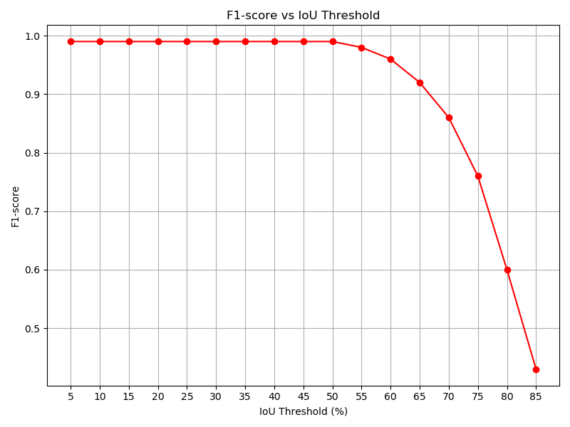

# Real-Time Object Detection and Avoidance in Robotics: Comparing Tiny-YOLOv3 and YOLOv3

Authors: Guillem Ribes Espurz (5229154), Ricardo Ramautar 

## Table of Contents
- [Abstract](#abstract)
- [Introduction](#introduction)
- [Motivation](#motivation)
  - [Training](#training)
  - [Robot Implementation](#robot-implementation)
- [Results](#results)
- [Discussion and Limitations](#discussion-and-limitations)
  - [Discussion](#discussion)
  - [Limitations](#limitations)
- [References](#references)
    
## Abstract

## Introduction

## Motivation 
In numerous applications, robots must operate in unregulated and dynamic environments filled with moving obstacles. To navigate in these challenging environments, robots require obstacle avoidance systems to ensure they do not collide. For instance, self-driving vehicles need to account for other vehicles, pedestrians, and cyclists, whose actions can be unpredictable. Consequently, the obstacle avoidance systems in these self-driving vehicles must be able to account for sudden, sporatic behavior. 

Nowadays, in robotics in order to perform obstacle avoidance other sensors such as LiDAR or ultrasound are being used instead of cameras. This introduces an issue of not knowing what obstacle you are avoiding (no classification performed). In some cases you don’t want to avoid all obstacles, if for example it’s a cleaning robot you don’t want it to avoid litter you instead want it to pick it up. However, if the robot can not differentiate between litter or an actual obstacle then it doesn’t perform accordingly. Which is why cameras should be introduced for obstacle classification in order to perform obstacle avoidance. Nonetheless, the use of cameras introduces larger models to perform obstacle avoidance, which in turn require expensive GPUs. However, not all robots are equipped with such GPUs due to their cost and space constraints. A more efficient solution is to develop smaller, more efficient models that demand minimal computational power. This would enable real-time obstacle detection on any robot, regardless of its hardware.

## Implementation 

### Training 

### Robot Implementation 
After obtaining the weights in the correct format (.weights) for the tiny-YOLOv3 model, the next step was to implement them on the robot. Initially, the darknetROS repository was utilized, as it supports the integration of tiny-YOLOv3 with ROS and requires only the implementation of the correct weights. The model was first tested on a laptop to evaluate its performance. As shown in the figure below, the model consistently detected manure and people. However, the frame rate achieved on the laptop was approximately 1.5 fps, resulting in noticeable lag during visualization.

To address this issue, the model was then run directly on the robot. Unfortunately, this led to a significant drop in performance, with the frame rate plummeting to 0.2 fps, which was far from acceptable.

To improve performance, the darknet configuration was converted to ncnn, a high-performance neural network inference framework optimized for mobile platforms. This conversion enabled the model to run on the robot at 5 fps, meeting the desired frame rate and providing smooth visualization.

**Add a table of the fps of YOLOv3 and tiny-YOLOv3**
## Results

**Overall Metrics and Average IoU**
| IoU Threshold | Precision | Recall | F1-score | TP  | FP  | FN  | Average mAP (%) |
|---------------|-----------|--------|----------|-----|-----|-----|-----------------|
| 5%            | 0.99      | 0.99   | 0.99     | 715 | 8   | 10  | 99.53           |
| 10%           | 0.99      | 0.99   | 0.99     | 715 | 8   | 10  | 99.53           |
| 15%           | 0.99      | 0.99   | 0.99     | 715 | 8   | 10  | 99.53           |
| 20%           | 0.99      | 0.99   | 0.99     | 715 | 8   | 10  | 99.53           |
| 25%           | 0.99      | 0.99   | 0.99     | 715 | 8   | 10  | 99.53           |
| 30%           | 0.99      | 0.99   | 0.99     | 715 | 8   | 10  | 99.53           |
| 35%           | 0.99      | 0.98   | 0.99     | 714 | 9   | 11  | 99.45           |
| 40%           | 0.99      | 0.98   | 0.99     | 714 | 9   | 11  | 99.43           |
| 45%           | 0.99      | 0.99   | 0.99     | 715 | 8   | 10  | 99.31           |
| 50%           | 0.99      | 0.98   | 0.99     | 714 | 9   | 11  | 99.23           |
| 55%           | 0.98      | 0.98   | 0.98     | 709 | 14  | 16  | 98.40           |
| 60%           | 0.96      | 0.96   | 0.96     | 696 | 27  | 29  | 96.85           |
| 65%           | 0.92      | 0.92   | 0.92     | 665 | 58  | 60  | 91.65           |
| 70%           | 0.86      | 0.86   | 0.86     | 625 | 98  | 100 | 85.38           |
| 75%           | 0.76      | 0.76   | 0.76     | 553 | 170 | 172 | 71.32           |
| 80%           | 0.60      | 0.60   | 0.60     | 434 | 289 | 291 | 47.13           |
| 85%           | 0.43      | 0.43   | 0.43     | 310 | 413 | 415 | 24.18           |

**Class-wise Average Precision**
| IoU Threshold | Manure (%) | Person (%) |
|---------------|------------|------------|
| 5%            | 99.86      | 99.20      |
| 10%           | 99.86      | 99.20      |
| 15%           | 99.86      | 99.20      |
| 20%           | 99.86      | 99.20      |
| 25%           | 99.86      | 99.20      |
| 30%           | 99.86      | 99.20      |
| 35%           | 99.70      | 99.20      |
| 40%           | 99.70      | 99.16      |
| 45%           | 99.70      | 98.93      |
| 50%           | 99.53      | 98.93      |
| 55%           | 98.71      | 98.08      |
| 60%           | 95.62      | 98.08      |
| 65%           | 88.62      | 94.68      |
| 70%           | 80.79      | 89.97      |
| 75%           | 68.60      | 74.03      |
| 80%           | 50.39      | 43.88      |
| 85%           | 33.62      | 14.74      |

----
### (Yolo V3 results)

| IoU Threshold | Precision | Recall | F1-score | TP  | FP  | FN  | Average mAP (%) |
|---------------|-----------|--------|----------|-----|-----|-----|-----------------|
| 5%            | 1.00      | 0.99   | 0.99     | 718 | 3   | 7   | 99.79           |
| 10%           | 1.00      | 0.99   | 0.99     | 718 | 3   | 7   | 99.79           |
| 15%           | 1.00      | 0.99   | 0.99     | 718 | 3   | 7   | 99.79           |
| 20%           | 1.00      | 0.99   | 0.99     | 718 | 3   | 7   | 99.79           |
| 25%           | 1.00      | 0.99   | 0.99     | 718 | 3   | 7   | 99.79           |
| 30%           | 1.00      | 0.99   | 0.99     | 718 | 3   | 7   | 99.79           |
| 35%           | 1.00      | 0.99   | 0.99     | 718 | 3   | 7   | 99.79           |
| 40%           | 1.00      | 0.99   | 0.99     | 718 | 3   | 7   | 99.79           |
| 45%           | 1.00      | 0.99   | 0.99     | 718 | 3   | 7   | 99.79           |
| 50%           | 1.00      | 0.99   | 0.99     | 718 | 3   | 7   | 99.79           |
| 55%           | 0.99      | 0.99   | 0.99     | 715 | 6   | 10  | 99.53           |
| 60%           | 0.96      | 0.96   | 0.96     | 695 | 26  | 30  | 96.56           |
| 65%           | 0.95      | 0.94   | 0.95     | 685 | 36  | 40  | 94.48           |
| 70%           | 0.92      | 0.91   | 0.92     | 663 | 58  | 62  | 91.94           |
| 75%           | 0.86      | 0.86   | 0.86     | 620 | 101 | 105 | 87.33           |
| 80%           | 0.75      | 0.75   | 0.75     | 544 | 177 | 181 | 80.07           |
| 85%           | 0.60      | 0.60   | 0.60     | 433 | 288 | 292 | 60.73           |
| 90%           | 0.33      | 0.33   | 0.33     | 236 | 485 | 489 | 27.35           |
| 95%           | 0.08      | 0.08   | 0.08     | 57  | 664 | 668 | 2.02            |

| IoU Threshold | Manure (%) | Person (%) |
|---------------|------------|------------|
| 5%            | 99.67      | 99.91      |
| 10%           | 99.67      | 99.91      |
| 15%           | 99.67      | 99.91      |
| 20%           | 99.67      | 99.91      |
| 25%           | 99.67      | 99.91      |
| 30%           | 99.67      | 99.91      |
| 35%           | 99.67      | 99.91      |
| 40%           | 99.67      | 99.91      |
| 45%           | 99.67      | 99.91      |
| 50%           | 99.67      | 99.91      |
| 55%           | 99.14      | 99.91      |
| 60%           | 96.20      | 96.93      |
| 65%           | 94.82      | 94.15      |
| 70%           | 90.71      | 93.16      |
| 75%           | 82.43      | 92.24      |
| 80%           | 67.90      | 92.24      |
| 85%           | 44.97      | 76.48      |
| 90%           | 13.97      | 40.73      |
| 95%           | 1.54       | 2.50       |

## Discussion and Limitations

### Discussion

### Limitations

## References 
